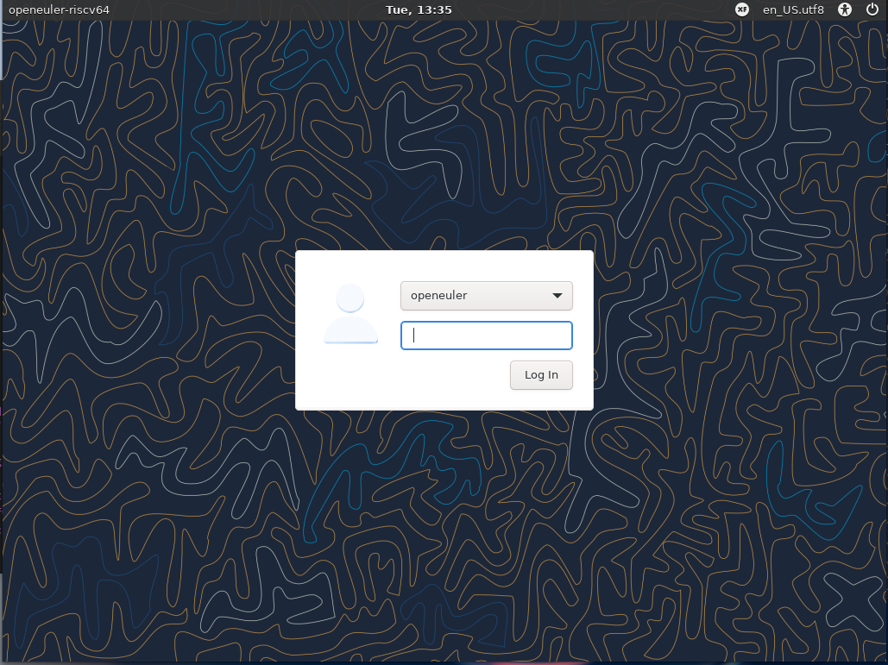
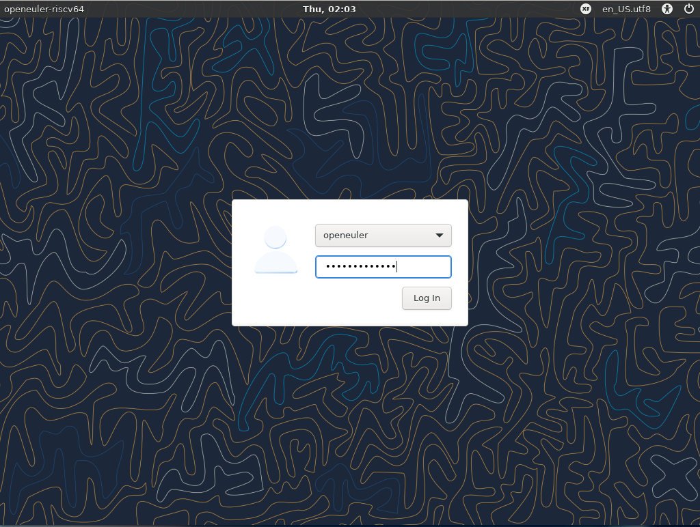
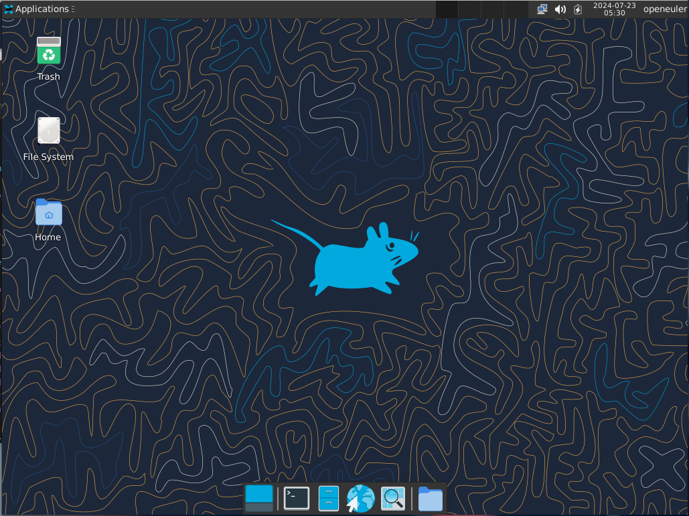
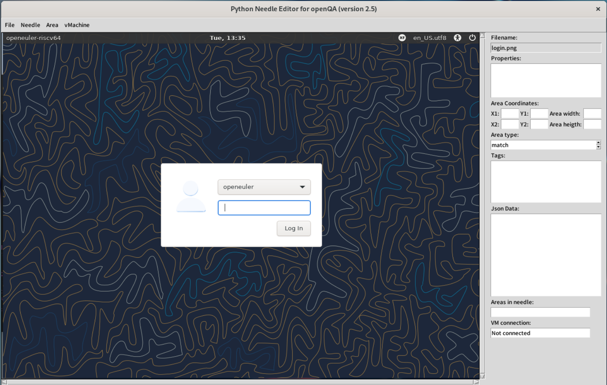
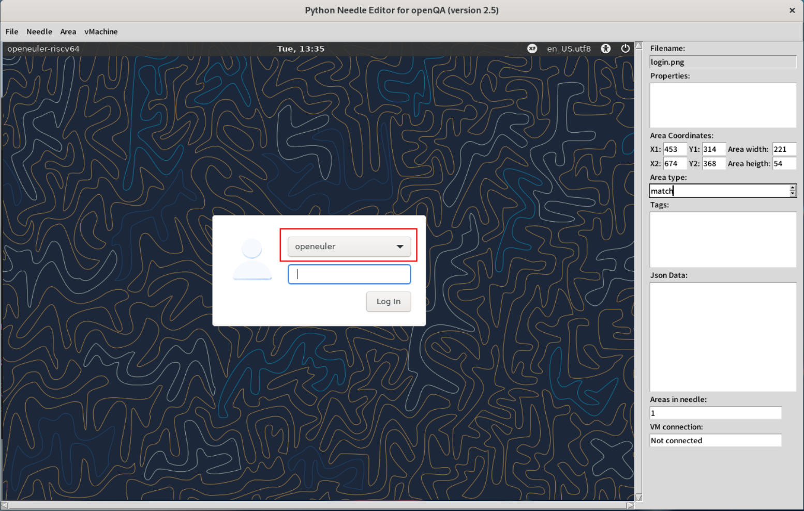
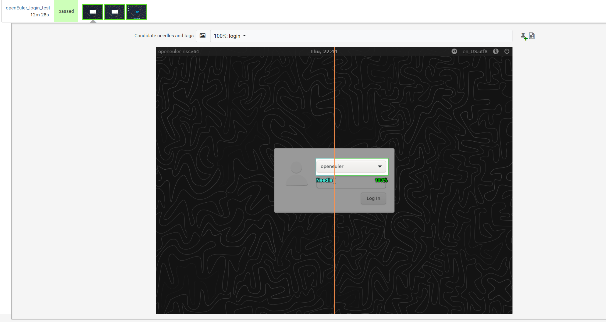
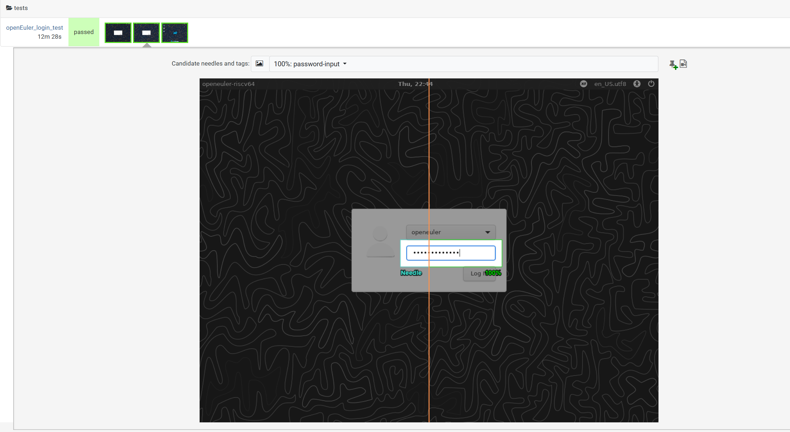
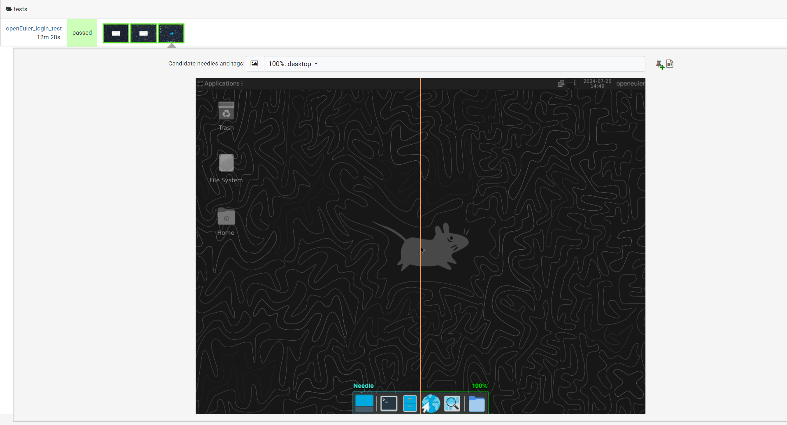

## oErv openQA xfce 桌面 login needles 设计流程

#### 简介

本文档记录一个简单的 oErv xfce桌面登录 OpenQA 测试用例的开发和使用。前置条件为完成 [oErv-OpenQA 的部署](https://gitee.com/lvxiaoqian/memo/blob/master/deploy-openQA-for-riscv.md)

#### Needles 基本概念

Needles 是 OpenQA 用于图像匹配的基本元素。每个 Needles 文件包含以下主要部分：

* `tags`：一个或多个标签，用于标识 Needles。
* `area`：一个或多个匹配区域，定义图像中的特定区域及其匹配类型。

每个匹配区域包含以下属性：

* `xpos`：区域的起始横坐标。
* `ypos`：区域的起始纵坐标。
* `width`：区域的宽度。
* `height`：区域的高度。
* `type`：匹配类型，可以是 `match`、`ocr` 或 `exclude`。
* `click_point`：可选的点击点，用于指定鼠标点击的位置。

#### Needles 用例设计

设计登录流程 Needles 用例的步骤：

1. **识别关键图像元素** ：确定需要匹配的关键图像元素，例如登录界面、用户名输入框、密码输入框等。
2. **截取屏幕截图** ：在实际环境中截取包含关键图像元素的屏幕截图。
3. **创建 Needles 文件** ：使用 [Needly](https://pagure.io/fedora-qa/Python-OpenQA-needle-editor) (可通过 [flatpak](https://flathub.org/oc/apps/io.github.lruzicka.Needly) 安装) 或 openQA-webui 中的 needle editor 等其他工具创建包含匹配区域和标签的 Needles JSON 文件。
4. **验证匹配效果** ：在 OpenQA 中运行测试脚本，验证 Needles 文件的匹配效果，并根据需要调整匹配区域和标签。

#### 具体设计

##### 1：识别关键的图像元素

确定登录流程中的关键图像元素：

* 登录界面
* 用户名输入框
* 密码输入框

##### 2：截取屏幕截图

在 QEMU 虚拟机中启动 openEuler 系统，并截取以下屏幕截图：

使用 QEMU 虚拟机启动 openEuler-riscv 的参考流程：[通过 QEMU 仿真 RISC-V 环境并启动 openEuler RISC-V 系统](https://www.openeuler.org/zh/blog/phoebe/2023-09-26-Run-openEuler-RISC-V-On-Qemu.html)

* `login.jpg`：显示登录界面
  
* `password_input.jpg`：密码输入后的密码框
  
* `desktop.jpg`：显示桌面界面
  

##### 3：创建 Needles 文件

使用 Needly 分别打开对应截图，创建以下 Needles 文件：

1. `login.json`

```json
   {
     "properties": [],
     "tags": [
       "login"
     ],
     "area": [
       {
         "xpos": 370,
         "ypos": 317,
         "width": 77,
         "height": 91,
         "type": "match"
       }
     ]
   }
```

2. `password_input.json`

```json
    {
     "properties": [],
     "tags": [
       "password-input"
     ],
     "area": [
       {
         "xpos": 455,
         "ypos": 388,
         "width": 215,
         "height": 43,
         "type": "match"
       }
     ]
    }
```

3. `desktop_toolbar.json`

```perl
    {
     "properties": [],
     "tags": [
       "desktop-toolbar"
     ],
     "area": [
       {
         "xpos": 361,
         "ypos": 719,
         "width": 308,
         "height": 49,
         "type": "match"
       }
     ]
   }
```

###### login Needles 样例设计流程参考：

1. 打开截图

   软件左上角 File->Open file 或 Open directory (打开目录后可使用 File->Load next 或 Load previous 切换)



2. 绘制选取

   直接在截图显示区域拖动鼠标框选



3. 添加选区

   框选完后需要点击 Area->Add area 使新增选区生效


##### 4：验证匹配效果

在 OpenQA 中运行测试脚本，验证 Needles 文件的匹配效果。根据需要调整匹配区域和标签，以确保匹配的准确性。

#### 对应测试脚本

以下是用于自动化登录流程的 Perl 脚本示例：

```perl
package openEuler_login_test;
use base "basetest";
use strict;
use testapi;

sub run {
    diag "Starting login test...";

    # 设置超时时间为1200秒 (20分钟)
    my $timeout = 1200;

    # 等待系统启动完成，可以通过检测某个特定的启动标志来实现
    # 例如，等待出现登录界面
    diag "Waiting for login screen to appear";
    assert_screen 'login', $timeout;

    # 输入密码
    diag "Entering password";
    type_string 'openEuler12#$', timeout => $timeout;
    assert_screen 'password-input', timeout => $timeout;

    # 发送 Enter 键以登录
    diag "Sending Enter key to login";
    send_key 'ret', timeout => $timeout;

    # 添加额外的等待时间，确保桌面完全加载
    diag "Waiting for the desktop to load completely";
    wait_still_screen stilltime => 180, timeout => 180;  # 设置stilltime和timeout为300秒 (5分钟)

    # 确认进入桌面
    diag "Checking if desktop is shown";
    assert_screen 'desktop-toolbar', $timeout;

    diag "Login test completed.";
}

1;
```

#### 测试通过效果

1. login



2. password-input



3. desktop



#### 个人 Needles 用例与脚本设计的一些注意点

+ 选取关键元素，同时避免选取动态元素，可以适当等待屏幕元素
+ 选取边界元素时注意框选范围，不要超出边界

#### 参考资料

+ [oErv-OpenQA 的部署](https://gitee.com/lvxiaoqian/memo/blob/master/deploy-openQA-for-riscv.md)
+ [通过 QEMU 仿真 RISC-V 环境并启动 openEuler RISC-V 系统](https://www.openeuler.org/zh/blog/phoebe/2023-09-26-Run-openEuler-RISC-V-On-Qemu.html)
+ [Needly : Python-OpenQA-needle-editor](https://pagure.io/fedora-qa/Python-OpenQA-needle-editor)
+ [Tarsier-Internship-oE-RISC-V-OpenQA简单测试用例开发.md](https://github.com/brsf11/Tarsier-Internship/blob/main/Document/OpenQA/oE-RISC-V-OpenQA%E7%AE%80%E5%8D%95%E6%B5%8B%E8%AF%95%E7%94%A8%E4%BE%8B%E5%BC%80%E5%8F%91.md)
+ [Unraveling the “Needle” in OpenQA Testing: A Tale of Precision and Visual Assertions](https://tanjuachaleke.wordpress.com/2023/12/28/unraveling-the-needle-in-openqa-testing-a-tale-of-precision-and-visual-assertions/)
