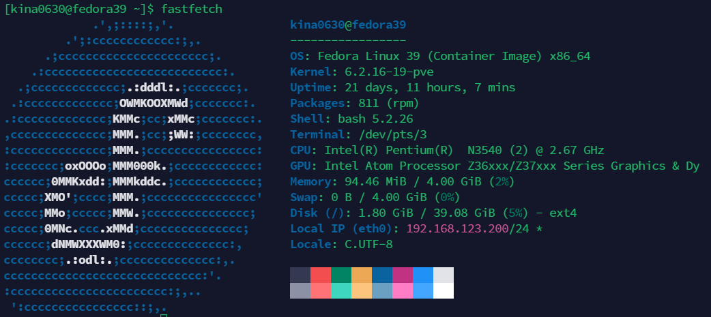
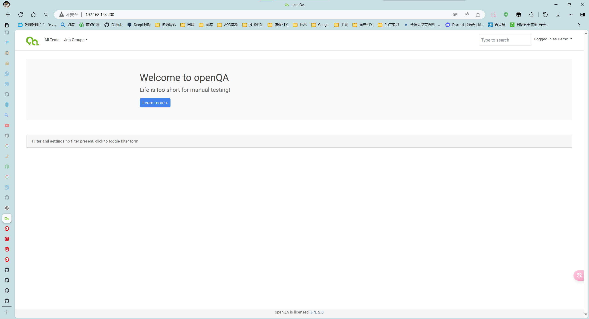

# openQA 搭建流程

## 系统环境

+ Proxmox Virtual Environment 8.0.4
+ Fedora-39-default LXC (V20231118, PVE 8.0.4 default)

### fastfetch 截图



## openQA 安装 (涉及到 PostgreSQL 的安装)

本次安装为普通用户

官方文档: [https://open.qa/docs/](https://open.qa/docs/)

Fedora 官方文档: [OpenQA direct installation guide - Fedora Project Wiki](https://fedoraproject.org/wiki/OpenQA_direct_installation_guide)

官方文档中提供了两种系统的安装方式：openSUSE, Fedora

在本文中选择了 Fedora 进行安装，本次搭建过程结合了两个文档食用

从 dnf 安装:

```shell
sudo dnf install openqa openqa-httpd openqa-worker
```

### 配置 httpd

```shell
cd /etc/httpd/conf.d/
sudo cp openqa.conf.template openqa.conf
sudo cp openqa-ssl.conf.template openqa-ssl.conf
sudo setsebool -P httpd_can_network_connect 1
sudo systemctl enable httpd
sudo systemctl restart httpd
```

sudo setsebool -P httpd_can_network_connect 1

这一步可能会遇到问题，参考碰到的问题中的 SELinux 问题

### 安装 PostgreSQL

```shell
sudo dnf install postgresql-server
sudo postgresql-setup --initdb
```

本文中为同一内网下的数据库，具体配置细节不再阐述，参照官方文档即可

本次配置过程中遇到的问题有：

+ 未配置安装教程中指定用户 geekotest 与数据库 openQA 导致 openqa-webui 启动失败，注意详细阅读官方文档即可

#### openQA 官方文档中关于数据库的部分

Database

openQA uses PostgreSQL as database. By default, a database with name openqa and geekotest user as owner is used. An automatic setup of a freshly installed PostgreSQL instance can be done using [this script](https://github.com/os-autoinst/openQA/blob/master/script/setup-db). The database connection can be configured in /etc/openqa/database.ini (normally the [production] section is relevant). More info about the dsn value format can be found in the [DBD::Pg documentation](https://metacpan.org/pod/DBD::Pg#DBI-Class-Methods).

+ [this script](https://github.com/os-autoinst/openQA/blob/master/script/setup-db) 需要注意一下，用于初始化数据库

### 配置 OAuth2 (未配置，因在本地搭建使用 Fake 模式)

OpenQA 支持三种不同的身份验证方法：OpenID（默认）、OAuth2 和 Fake（用于开发）

在此选择 OAuth2 进行身份验证

使用 OAuth2 需要安装额外的 Mojolicious 插件 (官方文档中给出了 openSUSE 包管理器 zypper 的安装命令)

Fedora 可能在安装 OpenQA 的过程中已经附带安装了该包

dnf 中对应的命令为：

```shell
sudo dnf install perl-Mojolicious
```

## 启动 Web-UI

```shell
sudo systemctl enable --now postgresql
sudo systemctl enable --now openqa-webui
sudo systemctl enable --now openqa-scheduler

```



## 启动 Worker，安装 Fedora 测试样例 (可选)

参考 Fedora 官方的 OpenQA 搭建文档即可

## 安装 qemu-riscv, 配置 oErv Worker

参考 [deploy-openQA-for-riscv.md](https://gitee.com/lvxiaoqian/memo/blob/master/deploy-openQA-for-riscv.md)

该文档中的测试用例没有运行成功，目前还不知道是什么问题

## 碰到的问题

**声明，以下问题不具有普适性，仅为个人在部署 openQA 过程中碰到的问题**

### SELinux 问题

```shell
sudo setsebool -P httpd_can_network_connect 1
```

可能的报错

cannot set persistent booleans without managed policy.

这个输出是因为没有开启 SELinux (?存疑)， 个人的解决方法是将 /etc/selinux/config 中 SELINUX 改为 permissive

Boolean httpd_can_network_connect is not defined

+ 解决方式参考

 [Changing SELinux States and Modes :: Fedora Docs (fedoraproject.org)](https://docs.fedoraproject.org/en-US/quick-docs/selinux-changing-states-and-modes/)
