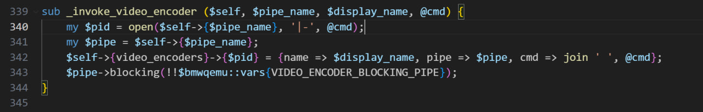

## 在优化现有 openQA 平台过程中碰到的一些问题

### 1. pve lxc nfs 问题 (未解决，可复现)

使用 pve fedora lxc 部署 openqa 后，因为宿主机性能有限，为改善测试体验，尝试连接本地局域网内另一台 PC 上的 openqa-worker

参考 [deploy-openQA-for-riscv.md](https://gitee.com/lvxiaoqian/memo/blob/master/deploy-openQA-for-riscv.md) 中 openqa 连接远端 worker 的步骤，需要启用 nfs

启用 nfs 时遇到问题，systemd nfs-server.service 对应日志：

```shell
openSUSE:~ # systemctl status nfs-server
○ nfs-server.service - NFS server and services
     Loaded: loaded (/usr/lib/systemd/system/nfs-server.service; enabled; vendor preset: disabled)
    Drop-In: /usr/lib/systemd/system/nfs-server.service.d
             └─10-options.conf, nfsserver.conf
     Active: inactive (dead)

Aug 02 07:43:48 openSUSE systemd[1]: Dependency failed for NFS server and services.
Aug 02 07:43:48 openSUSE systemd[1]: nfs-server.service: Job nfs-server.service/start failed with result 'dependency'.
```

如上日志并未提供更多有效信息，后续查阅资料发现 无特权的 lxc 为防止对宿主机内核造成破坏，因此被限制无法挂载 kernel patch

后续通过修改 lxc 配置文件 (路径为 /etc/pve/lxc/<容器 ID>)将其修改为特权容器后，可以在 pve webui 中勾选对应 nfs 等功能，但是勾选后重新启动容器时运行 su 等命令以及很多文件夹权限都出现了错误，后续将 lxc 文件系统挂载至 pve 宿主机下，尝试修复权限问题但失败，导致 sudo 等命令失效，原先的 openqa 也无法运行。

但原问题可通过在 pve 中另起新的 lxc 容器复现，待后续排查尝试解决

#### 参考资料

[Creating an NFS Server in an LXC : r/Proxmox (reddit.com)](https://www.reddit.com/r/Proxmox/comments/13zjo9f/creating_an_nfs_server_in_an_lxc/) (参考是否需要勾选 nesting 嵌套选项)

### 2. 运行 qemu 测试时尝试为 视频编码器文件 分配内存失败 (未解决，目前已无法复现)

```log
[2024-07-31T13:42:18.398683+08:00] [info] [pid:5563] ::: backend::baseclass::die_handler: Backend process died, backend errors are reported below in the following lines:
  Can't open($fh, '|-', 'nice', '-n', '19', '/usr/lib/os-autoinst/videoencoder', '/var/lib/openqa/pool/2/video.ogv', '-x', '1024', '-y', '768'): Cannot allocate memory at /usr/lib/os-autoinst/backend/baseclass.pm line 340
[2024-07-31T13:42:18.399996+08:00] [info] [pid:5563] ::: OpenQA::Qemu::Proc::save_state: Refusing to save an empty state file to avoid overwriting a useful one
```

对应日志中的 baseclass.pm 340行部分：



```perl
sub _invoke_video_encoder ($self, $pipe_name, $display_name, @cmd) {
    my $pid = open($self->{$pipe_name}, '|-', @cmd);
    my $pipe = $self->{$pipe_name};
    $self->{video_encoders}->{$pid} = {name => $display_name, pipe => $pipe, cmd => join ' ', @cmd};
    $pipe->blocking(!!$bmwqemu::vars{VIDEO_ENCODER_BLOCKING_PIPE});
}
```

运行测试时输出如上log，尝试增大虚拟机内存并限制 qemu 最大内存使用量无效，且手动使用 qemu 可以成功拉起 oErv，因此可以排除资源不足问题

初步怀疑为 /usr/lib/os-autoinst 文件夹权限问题，但尝试更改文件夹权限后依旧无法解决该问题

后续对比之前成功运行测试的 log，发现成功的 log 中对应视频编码器这行含有 ffmpeg 的调用：

```log
[2024-07-25T22:37:10.084529+08:00] [debug] [pid:41341] Launching external video encoder: ffmpeg -hide_banner -nostats -r 24 -f image2pipe -vcodec ppm -i - -pix_fmt yuv420p -c:v libsvtav1 -crf 50 -preset 7 'video.webm'
```

因此尝试 sudo dnf install ffmpeg，但仍然报错，后续尝试 sudo dnf update 以更新 ffmpeg，在更新 1.5G 的内容后虚拟机环境被搞炸，该问题无法复现解决

### 3. 读取已损坏的 VMware 虚拟机磁盘 (已解决)

在 Fedora 虚拟机中保存有 gedit 的 needles 测试用例，但因为 sudo dnf update 更新失败导致系统环境被破坏，且没有将用例文件拷贝至本地做备份

尝试通过 [DiskGenius](https://www.diskgenius.com/) 与 [ImDisk](https://sourceforge.net/projects/imdisk-toolkit/) 软件读取虚拟硬盘中的数据，均失败

后续通过新建 openSUSE VMware 虚拟机，将原 Fedora 虚拟磁盘挂载至 openSUSE 虚拟机下可成功读取，将原 gedit 测试用例成功拷贝出来

挂载方法：

[将现有虚拟硬盘添加到虚拟机 (vmware.com)](https://docs.vmware.com/cn/VMware-Workstation-Pro/17/com.vmware.ws.using.doc/GUID-430C2B24-6287-4B2C-8F77-224938CE2C9B.html)

### 4. openQA 部署系统选择

在前两次经历 Fedora 系统部署 openQA 的过程后，现在部署选择了 openSUSE 系统，因为 openSUSE 系统支持 openQA 一键部署脚本，相较于 Fedora 系统部署相当轻松，因此个人推荐在进行 openQA 平台的部署时直接使用 openSUSE 系统
